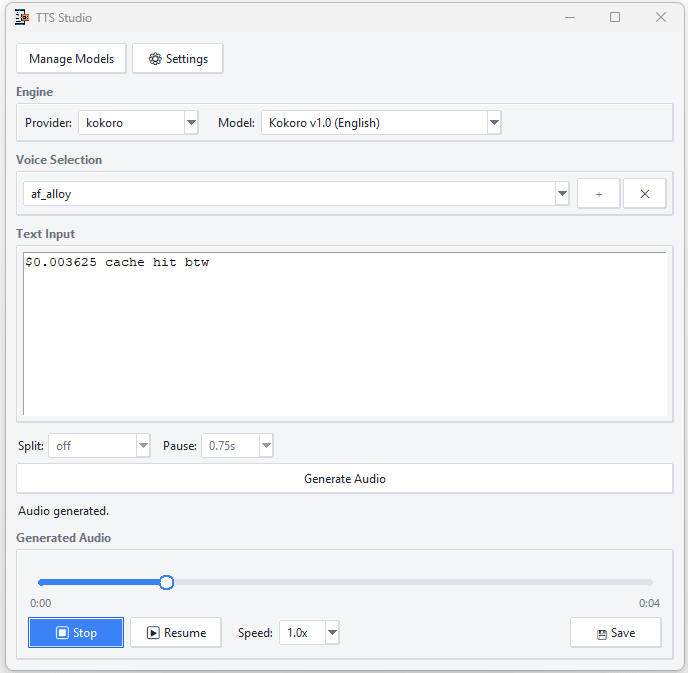

<h1 align="center">TTS Studio</h1>

<p align="center">
  Lightweight multi-engine desktop GUI for local TTS models

</p>

<p align="center">
  <a href="https://github.com/AmitTzah/TTS-Studio/blob/main/LICENSE"></a>
  
  
</p>

<p align="center">
  
</p>

---

Two TTS engines with multiple models each: **Kokoro** (54 fixed voices, 9 language variants) and **Chatterbox** (voice cloning, 23+ languages, paralinguistic tags). Switch engines and models via the Provider and Model dropdowns.

> **Coming soon:** OmniVoice engine — 600+ languages, voice cloning + voice design. ([feature branch](https://github.com/AmitTzah/TTS-Studio/tree/feature/omnivoice-provider))

## Install

Python 3.8–3.12. **Tested on Windows.** Linux/macOS may work but haven't been verified — PRs welcome.

### Windows

Install [eSpeak NG](https://github.com/espeak-ng/espeak-ng/releases) to `C:\Program Files\eSpeak NG`.

```bash
git clone https://github.com/AmitTzah/TTS-Studio
cd TTS-Studio
pip install -e .                    # Kokoro engine
pip install chatterbox-tts          # Chatterbox engine (optional)
python scripts/setup.py             # pre-download models
python -m tts_studio                # launch
```

Or skip `setup.py` — the GUI downloads models on first use via **Manage Models**.

For NVIDIA GPU:

```bash
pip uninstall torch torchvision torchaudio -y
pip install torch torchvision torchaudio --index-url https://download.pytorch.org/whl/cu124
```

### Linux / macOS

Install eSpeak NG via your package manager (`apt install espeak-ng` / `brew install espeak-ng`), then follow the same steps above. Chatterbox requires CUDA — CPU-only users should stick with Kokoro.

## Usage

1. Pick a **Provider** and **Model** from the dropdowns
2. Select a voice, type text, click **Generate Audio**
3. Play, pause, seek, adjust speed, or save as WAV

Use the **Manage Models** button to download or delete models. Models are stored in `models/` (gitignored). Voice cloning is available with Chatterbox — click ＋ to add a voice from a reference audio clip.

## Text Chunking

The **Split** and **Pause** dropdowns control how text is broken up before generation. Chatterbox produces nonsense after more than a few paragraphs, so TTS Studio provides paragraph and sentence chunking with configurable pause gaps between chunks. Kokoro handles long text natively.

## Available Models

| Model | Provider | Voices | Languages | Size |
|-------|----------|--------|-----------|------|
| Kokoro v1.0 | Kokoro | 54 fixed | 9 | 82M |
| Chatterbox Turbo | Chatterbox | Default + cloning | English | 350M |
| Chatterbox Multilingual V3 | Chatterbox | Default + cloning | 23+ | 500M |

## Structure

```
TTS-Studio/
├── tts-gui.pyw                  ← double-click launcher (Windows)
├── scripts/setup.py             ← CLI setup wizard
├── src/tts_studio/
│   ├── app.py                   ← multi-engine controller
│   ├── generation.py            ← text chunking + generation manager
│   ├── voice_manager.py         ← voice cloning + selection
│   ├── settings.py              ← per-engine settings persistence
│   ├── config.py                ← paths, eSpeak, sample rate
│   ├── engines/                 ← TTSEngine abstraction
│   │   ├── base.py              ← abstract base + ModelInfo/VoiceInfo
│   │   ├── kokoro_engine.py
│   │   └── chatterbox_engine.py
│   ├── models/                  ← model catalog + downloader
│   ├── audio/                   ← player (pygame) + saver
│   ├── tts/                     ← Kokoro audio generator
│   └── ui/                      ← main window, model manager, settings, seek bar
├── tests/                       ← 39 tests (unit)
├── models/                      ← model storage (gitignored)
└── pyproject.toml
```

## Dev

```bash
pip install pytest
python -m pytest tests/ -v       # 39 tests, <1s
```

Tests cover all pure-logic modules: config, registry, settings, engine, player, text utils, generation, voice manager. GUI modules need a display for testing.

## License

Apache 2.0.
